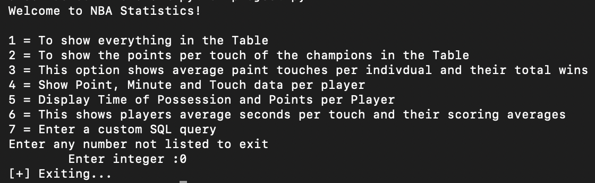
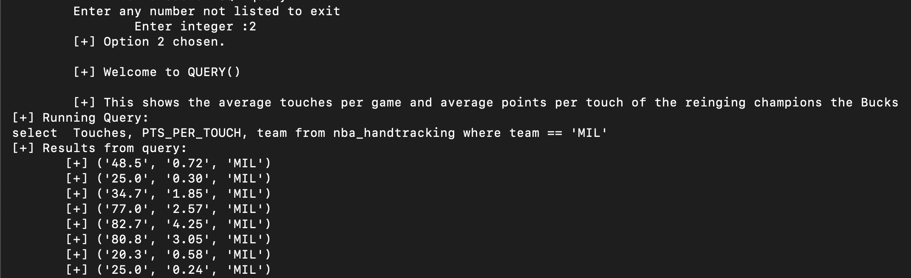
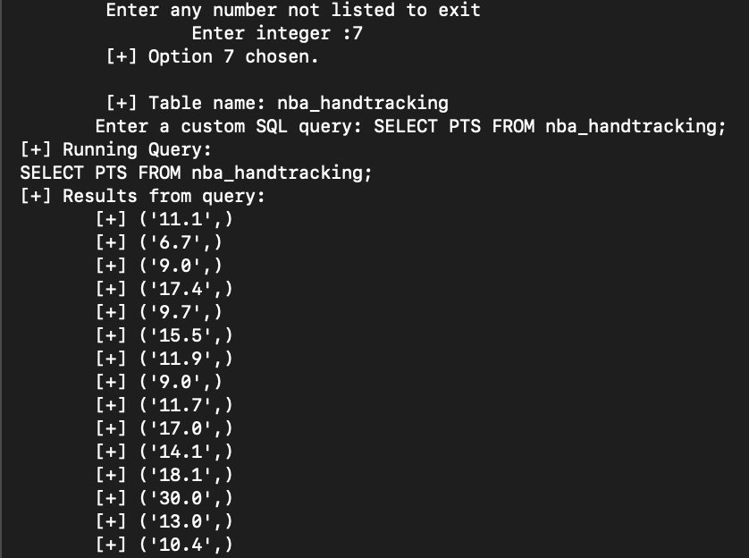
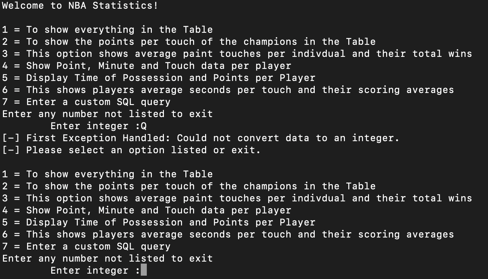
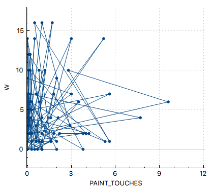
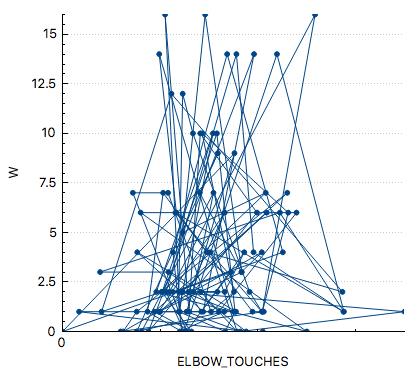
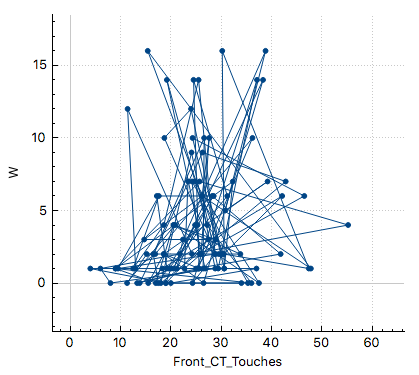

### cs312S2022


#### Names of group members

Luke Lacaria

Esteban Mendez

Liam Black

#### Group Name

Project NBA


#### Due Date: Project

18 May 2022

_Please note: no extensions are possible for this assignment._


#### Overview

 - Offer several screenshots of the system in use.

 ```
 The screenshots will be provided here as well as in the writing folder.
 ```





 - What is the title of this work?

 ```
 NBA Statistics
 ```

 - Describe the software decision of your project. Why was this particular software selected?

  ```
 The software that we selected for this project was python and sqlite, because it is easier to keep the sqlite just for the database manager and not to the public, and it is really easy for users to use a python menu and interact with it than entering commands in sqlite. 
 python
 sqlite
 ```

 - Which references used in this project to motivate your work.

 ```
 https://www.nba.com/stats/players/touches/?Season=2020-21&SeasonType=Playoffs
 ```

#### Data

 - What is the data for your project?

 ```
 The data for the project is the NBA handtracking in which will tell us the hand tracking and more stats from the NBA website, in which has a lot of sections. All of these sections have their own job in the analysis part of the data, because this makes the data be manageble for it to be accurate and have everything involved when doing hand tracking analysis. 
 ```

 - How was this data collected? Please name any biases that you anticipate.

 ```
 The data was collected by copying everything in the website. The data was selected from the NBA website, about the playoffs in the NBA. The data that we gathered was for the hand tracking analysis that we are doing. There is a lot of information in the file in which we put all inside an csv file for having the data separeted by commas and it is easier for us to use with sqlite. 
 ```

 - Provide the citation of your dataset.

 ```
 Players touches. NBA Stats. (n.d.). Retrieved May 16, 2022, from https://www.nba.com/stats/players/touches/?Season=2020-21&SeasonType=Playoffs 
 ```

#### Use

 - What are the intended applications of your database?
```
 The intended application for the database is for NBA analysis of hand tracking. This makes the data easy for people to see the database in python and can show users the analysis. There are queries that you can see in the database that we wrote in the python file for it to run, that makes the user interaction easier with python than with sqlite. 
```

 - Who are the intended users of the database and its data?

```
 The intended users of the database and its data is people that like NBA, or even people that like sports. Another section of people that like this kind of data is the people that have blogs or youtube channels about analysing the players and how this affects how many points they score in a game. Mostly them, because they have a real interst in what the data is saying and displaying. 
```

 - What are the necessary skills that the users must have to work with the database?

```
 There are not necesary skills for the users to have to use the database. The only thing they need to know is how to se the menu, in which is not complicated at all, just input the number of the option that the user would like and wait until the program to run the query. If they want to chose another one, just input another number that is available in the menu and the option will run for the user. 
```

#### Ethics

 - Imagine that your database contained personal information that was collected to complement the present data it contains. What ethical concerns would there be if this database were released (voluntarily or involuntarily) to the public with this data?

```
 If the database had personal information that is collected to complement the present data it contains, I would not be able to share the information that it has, because it is to prevent unethical concerns. If the data was released to the public everyone would have access to it and we would try to make it as personal as it can be, because it is dangerous for people to give out personal information and it is illegal too. 
```

 - What types of security would be necessary to prevent the above ethical concerns from becoming a reality?

```
 The types of security that could be necessary for our database to prevent the above ethical concerns for becoming a reality is that the database needs to have some sort of login system so the user can log in with their own credentials. This would make the process of protection way easier and we would create also a backup of the data always when it is updated so we have the latest database saved and ready to go if something happens to the database.
```

 - Describe another form of security to recommend for the safety of the data.

```
 Another form of security for the safety of the data is to have a username for each of the users taht are going to use the database with their password, so they are the only ones that can access the information, another thing is when signing in, the users need to input a code that is send to their phone or email, Two step verification, so that oonlhy the user that owns that account can access the information that is only from him and the database. That would be another form of security for the safety of the data, which makes a lot of sense, because the Two Step Verification makes it just available for the people that really own the account. 
```


#### Research Questions

 - Provide the five research questions of this project, along with their queries and results. For each result, what can be understood by the result?

#### 1

 - Research question:

 ```
 How do total touches and points compare from the reigning nba champions(Milwalkee Bucs), and their first round opponent(Miami Heat)?
 ```

 - Query
 ```
select  AVG(Touches), AVG(PTS_PER_TOUCH), team from nba_handtracking where team == "MIL";
select  AVG(Touches), AVG(PTS_PER_TOUCH), team from nba_handtracking where team == "MIA";
select  Touches, PTS_PER_TOUCH, team from nba_handtracking where team == "MIL";
select  Touches, PTS_PER_TOUCH, team from nba_handtracking where team == "MIA";
 ```

 - Partial output (up to ten rows of output)

 ```
  [+] Welcome to QUERY()

	 [+] This shows the average touches per game and average points per touch of the reinging champions the Bucks
 [+] Running Query:
 select  Touches, PTS_PER_TOUCH, team from nba_handtracking where team == 'MIL'
 [+] Results from query: 
	[+] ('48.5', '0.72', 'MIL')
	[+] ('25.0', '0.30', 'MIL')
	[+] ('34.7', '1.85', 'MIL')
	[+] ('77.0', '2.57', 'MIL')
	[+] ('82.7', '4.25', 'MIL')
	[+] ('80.8', '3.05', 'MIL')
	[+] ('20.3', '0.58', 'MIL')
	[+] ('25.0', '0.24', 'MIL')
 ```

 - What do we conclude from this result?

 ```
 My hypothesis is that the team who averages more touches and more points per touch is the team that won the series and is a better team overall. I will be able to check these queries against the knowledge that the Bucks ended up winning this series 4-0 so I expect them to have higher numbers here. After running this queries it shows your the playoff average touches and points per touch for individuals on the Bucks and individuals on the Heat who played eachother in the first round of the playoffs. If you run the AVG queries to see the team averages you see that the Miami heat actually averaged almost .5 more points per touch as a team than the bucks(MIL). However if you look at the outcome of the series the Bucks actually won the series fairly easy in a 4-0 victory of a best of 7 series. The question that comes up from this is why then does the team that did not win a game in the plyoffs average more points per touch than the champions of the datasets playoffs? One thing we can conclude from this result is the amount of touches and the points per touch does not tell you the whole story of a game or of a series. When looking at the roster of the bucks there are more people who partipated in games than players on the heat. When comparing these results of having more players it is likely that average touches for players will go down because there is more people that have the potential to touch the ball in a given game. To explain why average points per touch was lower as a team was not as easily answered by this. When looking at graphs of the 3rd and 4th queries we found that since the Miami Heat had less players the bulk of their scoring was done by 4/6 of their players, averaging over 1.5 points per touch while the bucks had 4/8 players with over 1.5 points per touch. This concludes that the size of the player pool can greatly affect the overall game statistics of a team and you can't always see the whole story without looking at a wide range of variables. I orginally went to answer this question only looking at average touches and average points per touch of the players on these teams, but soon realized my hypothesis was incorrect looking at only these two statistics. One future idea I would like to conduct here would be finding p-values and multiple r squared values to determine the significance of the data, but it is safe to assume here that not including the number of players who play in a game was why this research question wasn't as straightforward as I expected.  
 ```

#### 2

 - Research question:

 ```
 Out of all the teams do wins have a higher positive correlation with paint touches, elbow touches, or front court touches per game?
 ```

 - Query
 ```
select team, W, PAINT_TOUCHES from nba_handtracking;
select team, W, ELBOW_TOUCHES from nba_handtracking;
select team, W, Front_CT_Touches from nba_handtracking;
 ```

 - Partial output (up to ten rows of output)


```
 Enter any number not listed to exit
		 Enter integer :3
	 [+] Option 3 chosen.

	 [+] Welcome to QUERY()

	 [+] This option shows average paint touches per indivdual and their total wins
 [+] Running Query:
 select player, team, W, PAINT_TOUCHES from nba_handtracking;
 [+] Results from query: 
	[+] ('Aaron Gordon', 'DEN', '4', '2.1')
	[+] ('Alex Len', 'WAS', '0', '0.7')
	[+] ('Andre Drummond', 'LAL', '2', '2.2')
	[+] ('Anthony Davis', 'LAL', '2', '4.2')
	[+] ('Austin Rivers', 'DEN', '4', '0.0')
	[+] ('Bam Adebayo', 'MIA', '0', '3.8')
	[+] ('Ben Simmons', 'PHI', '7', '1.8')
	[+] ('Blake Griffin', 'BKN', '7', '0.6')
	[+] ('Boban Marjanovic', 'DAL', '1', '5.3')
	[+] ('Bobby Portis', 'MIL', '2', '4.0')
	[+] ('Bogdan Bogdanovic', 'ATL', '10', '0.2')
	[+] ('Bojan Bogdanovic', 'UTA', '6', '0.8')
	[+] ('Bradley Beal', 'WAS', '1', '0.6')
	[+] ('Brook Lopez', 'MIL', '16', '1.7')
	[+] ('Bruce Brown', 'BKN', '2', '0.2')
	[+] ('CJ McCollum', 'POR', '2', '0.0')
```


 - What do we conclude from this result?

 
 
 From these results and after looking at these three graphs we concluded that the teams that win the most have the closest positive correlation between front court touches averages and Wins. When looking at plot 1 you can see that there is not much of a positve correlation going on, the results are very stacked close to 0-2 average paint touches per game, and even those numbers yielded higher number of wins than larger x values here. We can determine from this that most teams are utilizing a different kind of offense that is ran through players getting the ball and taking shots outside of the paint!

 

 From the second graph which is the relationship between elbow touches and wins we see a stornger more positive correlation than paint touches and you can imagine a line in a positive direction but the points here are stil a little spread out. However we  also see very low numbers of average elbow touches for the players on a team  number of elbow touches here that still have high win count. From looking at these results we are able to see that teams that win more average around .5 elbow touches per possesion. This also helps us to conclude strategies of teams and how the elbow is not as common for average touches as other areas and players seem to get the ball in the front court or catch the ball in the paint more often than by the free throw line.

 

 This last plot shows the strongest correlation and is displaying average front court touches per player per game on the x axis with number of wins on the y. This last plot not only shows the strongest positive correlation of the three graphs but also has the most amount of touches per are beating the other two by large. this graph clears shows that the more front court touches a player had on a team the higher the win count was. The highest win counts were associated with from court touches from an average of 20-40 per game. While there could be a multitude of reasons why front court touch numbers more than 40 resulted in a decline  I belive one factor is a team that defended players well forced them to keep the ball outside of the paint and forced them into lower percentage shots as a resut.
 

#### 3

 - Research question:

 ```
  Do players who average seconds per touch score more?
 ```

 - Query
 ```
 select player, time_of_poss, pts from nba_handtracking;
 ```

 - Partial output (up to ten rows of output)

 ```
 [+] Welcome to QUERY()

	 [+] This shows players average seconds per touch and their scoring averages
 [+] Running Query:
 select player, time_of_poss, pts from nba_handtracking
 [+] Results from query: 
	[+] ('Aaron Gordon', '1.6', '11.1')
	[+] ('Alex Len', '0.4', '6.7')
	[+] ('Andre Drummond', '0.8', '9.0')
	[+] ('Anthony Davis', '2.0', '17.4')
	[+] ('Austin Rivers', '1.4', '9.7')
	[+] ('Bam Adebayo', '2.8', '15.5')
	[+] ('Ben Simmons', '5.4', '11.9')
	[+] ('Blake Griffin', '1.4', '9.0')
	[+] ('Boban Marjanovic', '1.0', '11.7')
	[+] ('Bobby Portis', '1.4', '17.0')

 ```

 - What do we conclude from this result?

 ```
 When looking at the total output of this query we can see a very high correlation  of time of possesion of the ball and points per game. While there are some outliers when looking at a plot of this data we would be able to conclude that players who have the ball longer in their hands tend to be the players that score more. Some more conclusions we could make from this data with a connecting database is how many passes per game to players with lower times of possesion make? With this query we can clearly see that there is a positve linear correlation between amount of time the ball is in the players hands and how many points they score a game because teams try to get the ball to players that have better abilites to potentially get a score.
 ```


#### 4

 - Research question:

 ```
 Do players who score and get minutes consistently in the playoffs have high touches?
 ```

 - Query
 ```
 SELECT player, PTS, Min, Touches FROM nba_handtracking WHERE Pts > 10 AND Min > 25
 ```

 - Partial output (up to ten rows of output)

 ```
 [+] Running Query:
 SELECT player, PTS, Min, Touches FROM nba_handtracking WHERE Pts > 10 AND Min > 25
 [+] Results from query: 
	[+] ('Aaron Gordon', '11.1', '29.9', '36.6')
	[+] ('Anthony Davis', '17.4', '28.8', '52.4')
	[+] ('Austin Rivers', '9.7', '31.6', '26.0')
	[+] ('Bam Adebayo', '15.5', '34.0', '61.0')
	[+] ('Ben Simmons', '11.9', '33.5', '82.8')
	[+] ('Blake Griffin', '9.0', '26.5', '41.7')
	[+] ('Bobby Portis', '17.0', '34.1', '48.5')
 ```

 - What do we conclude from this result?

 ```
 From the results, it seems as if most players who score and get minutes consistently in the playoffs usually get at least 25 touches. However, there is a large variety between the number of touches players get. So it can be assumed that players that score and get minutes usually get a baseline amount of touches. From there, it likely depends on the players' style of play as to how many touches they get. For example, an effective catch and shoot player can get minutes and score without a lot of touches, but will still likely get at least the baseline of around 25 touches. Whereas effective playmakers and distributors are more likely to have very high touch numbers since they will touch and move the ball sometimes multiple times throughout a possesion.
 ```


#### 5

 - Research question:

 ```
 Does time of possesion correlate with scoring?
 ```

 - Query
 ```
 SELECT player, Time_of_Poss, PTS FROM nba_handtracking WHERE Time_of_Poss > 1
 ```

 - Partial output (up to ten rows of output)

 ```
 [+] Running Query:
 SELECT player, Time_of_Poss, PTS FROM nba_handtracking WHERE Time_of_Poss > 1
 [+] Results from query: 
	[+] ('Aaron Gordon', '1.6', '11.1')
	[+] ('Anthony Davis', '2.0', '17.4')
	[+] ('Austin Rivers', '1.4', '9.7')
	[+] ('Bam Adebayo', '2.8', '15.5')
	[+] ('Ben Simmons', '5.4', '11.9')
	[+] ('Blake Griffin', '1.4', '9.0')
 ```

 - What do we conclude from this result?

 ```
 Time of possesion appears to be correlated more to playstyle than to points. There is a wide variance between a players' points and their time of possesion. This implies that time of possesion may not be very relevent in determining a players' impact on the game or their scoring ability. While it may be thought that a player that gets high possesion times is likely skilled in order to get the ball that often in the first place, there doesn't seem to be any statistical evidence to support this. In conclusion, time of possesion can be an indicator of skill or scoring, but it is not necessarily correlated to it. A player who has very high times of possesion may be a good scorer, or there could be other factors at play.
 ```

---

(Did you remember to add your name to the top?)
