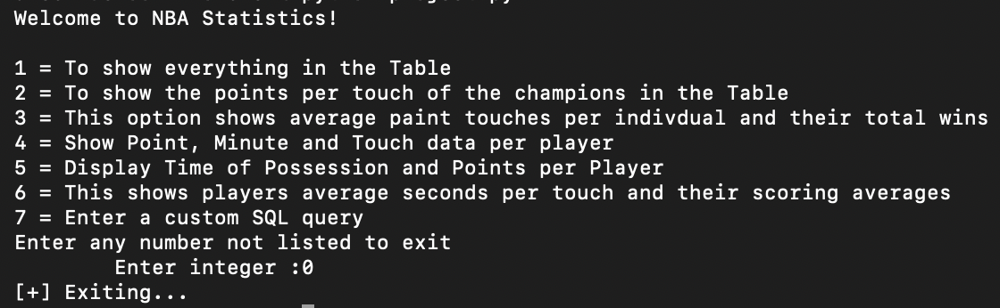
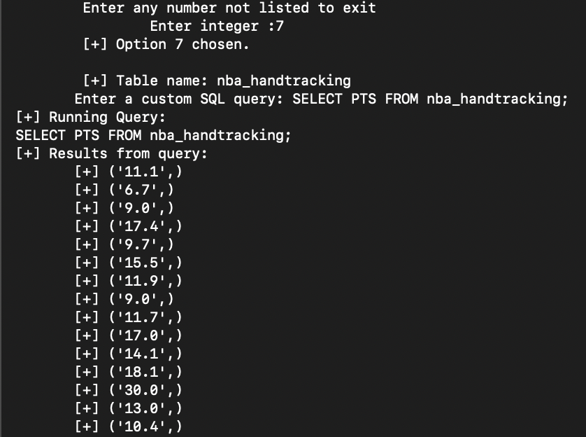
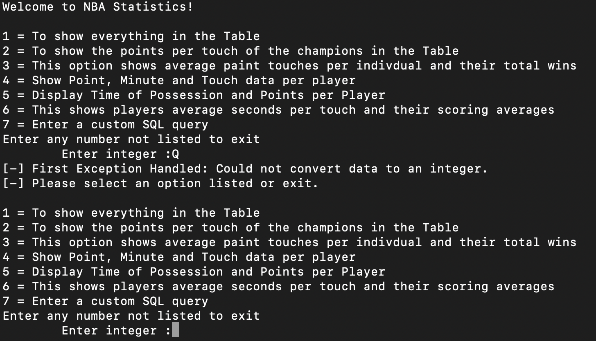
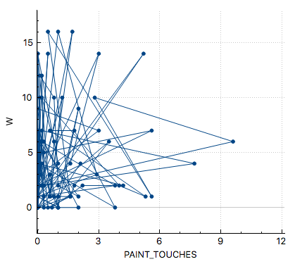
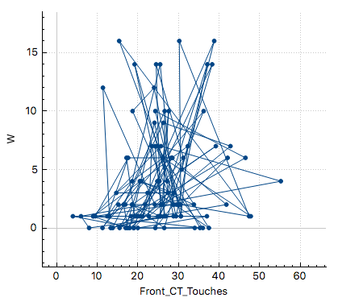

### cs312S2022


#### Names of group members

Luke Lacaria

Esteban Mendez

Liam Black

#### Group Name

Project NBA


#### Due Date: Project

18 May 2022

_Please note: no extensions are possible for this assignment._


#### Overview

 - Offer several screenshots of the system in use.

 ```
 The screenshots will be provided below as well as in the screenshots folder.
 ```





 - What is the title of this work?

 ```
 NBA Statistics
 ```

 - Describe the software decision of your project. Why was this particular software selected?

 ```
 The software that we selected for this project was Python and SQLite, because it is easier to keep the SQLite just for the database manager and not to the public, and it is really easy for users to use a Python menu and interact with it than entering commands in SQLite, additional more users are familiar with Python than SQL. This allowed us to have a very efficient database in SQL, that was easily accessible through our Python program. This helped make our database both robust and accessible.
 ```

 - Which references used in this project to motivate your work.

 ```
 https://www.nba.com/stats/players/touches/?Season=2020-21&SeasonType=Playoffs
 ```

#### Data

 - What is the data for your project?

 ```
 The data for the project is the NBA hand tracking in which will tell us the hand tracking and more stats from the NBA website, in which has a lot of sections. All of these sections have their own job in the analysis part of the data, because this makes the data manageable for it to be accurate and have everything involved when doing hand tracking analysis. The hand tracking analysis refers to the data the NBA keeps regarding where players touch the ball throughout the game, and their efficiencies from these different spots.
 ```

 - How was this data collected? Please name any biases that you anticipate.

 ```
 The data was collected by downloading select data from the NBA website's Players Tracking Touches section. The data was selected from the NBA website, about last year's NBA playoffs (since this is the most recent complete playoff data set). The data that we gathered was for the hand tracking analysis that we are doing. There is a lot of information in the file in which we put all inside an csv file, since we were initially having some issues with a tab-separated-value file. We then used a build file to create our SQLite database and table, and insert the data we collected into it. The only bias that our group anticipates would be a selection bias, because the data was in no way randomly selected. However, I think this is irrelevant since we are purposefully investigating the data we selected.
 ```

 - Provide the citation of your dataset.

 ```
 Players touches. NBA Stats. (n.d.). Retrieved May 16, 2022, from https://www.nba.com/stats/players/touches/?Season=2020-21&SeasonType=Playoffs
 ```

#### Use

 - What are the intended applications of your database?
 ```
 The intended application for the database is for NBA analysis of hand tracking. This makes the data easy for people to see the database in python and can show users the analysis. There are queries that you can see in the database that we wrote in the Python file for it to run, that makes the user interaction easier with Python than with SQLite. We also included a custom query function so that those who are familiar with SQL do not feel limited by our implementation. This should provide people with little technical knowledge access to our database. This way both novice coders, and SQL pros alike can gain valuable insights from our database.
 ```

 - Who are the intended users of the database and its data?

 ```
 The intended users of the database and its data are people that like the NBA, or even people that like sports, but may not have SQLite programming expertise. This is because we aimed to make our program understandable and usable, even to people with no to low coding experience. Another section of people that may like this kind of data is the people that have blogs or youtube channels that analyze data to try to come to an informed conclusion on players and trends. Anyone who needs to access, analyze, or share data from the 2020-2021 NBA Playoffs could benefit from our database and its data.
 ```

 - What are the necessary skills that the users must have to work with the database?
 ```
 There are not necessary skills for the users to have to use the database. The only thing they need to know is how to read the menu, which is not complicated at all, just input the number of the option that the user can see whatever data they desire. If they want to see different data, just input another number that is available in the menu and the option will run for the user. Our program can be operated from start to quit by only responding to prompts. The only requirement to use our database is knowledge of how to start a Python program in the terminal.  We also implemented a custom query function, which allows users who do know SQL to input queries of their own if they wish to see more specific data.
```

#### Ethics

 - Imagine that your database contained personal information that was collected to complement the present data it contains. What ethical concerns would there be if this database were released (voluntarily or involuntarily) to the public with this data?
 ```
 If the database had personal information that is collected to complement the present data it contains, I would not be able to share the information that it has, because it would be highly unethical. If the data was released to the public everyone would have access to it and we would try to make it as private as it can be, because it is dangerous for people to give out personal information and it is illegal too. Our database is not suited for information this sensitive, so there would be a variety of ethical concerns and design changes needed in a scenario where personal information was collected and released.
```

 - What types of security would be necessary to prevent the above ethical concerns from becoming a reality?
 ```
 The types of security that could be necessary for our database to prevent the above ethical concerns from becoming a reality is that the database needs to have some sort of login system so the user can log in with their own credentials. This would make data protection far easier and we would also create a backup of the data or store personal information on a secure server so that data is safe and accessible. Additionally, in a scenario where we are storing personal data, we would pay much closer attention to data security in the design of our program. We may not even use Python in a situation like this because of its lack of security.
```

 - Describe another form of security to recommend for the safety of the data.
 ```
 An additional form of security that could be used if we implemented a login system could be two-factor authentication, which is generally the gold standard for account security. Conversely, a cryptographic hash system could be created, where each user is given a private key which corresponds to a public key and gives them access to their personal information. This could be more secure than two-factor authentication, but threatens simplicity. In a key pair system a user who lost their private key would have no recourse, and much more unnecessary complexity would be introduced. However, in a scenario where our database would need to handle sensitive personal information it would be wise to do a complete redesign to ensure security from top to bottom.
```


#### Research Questions

 - Provide the five research questions of this project, along with their queries and results. For each result, what can be understood by the result?

#### 1

 - Research question:

 ```
 How do total touches and points compare from the reigning nba champions(Milwalkee Bucks), and their first round opponent(Miami Heat)?
 ```

 - Query
 ```
select  AVG(Touches), AVG(PTS_PER_TOUCH), team from nba_handtracking where team == "MIL";
select  AVG(Touches), AVG(PTS_PER_TOUCH), team from nba_handtracking where team == "MIA";
select  Touches, PTS_PER_TOUCH, team from nba_handtracking where team == "MIL";
select  Touches, PTS_PER_TOUCH, team from nba_handtracking where team == "MIA";
 ```

 - Partial output (up to ten rows of output)

 ```
  [+] Welcome to QUERY()

	 [+] This shows the average touches per game and average points per touch of the reinging champions the Bucks
 [+] Running Query:
 select  Touches, PTS_PER_TOUCH, team from nba_handtracking where team == 'MIL'
 [+] Results from query: 
	[+] ('48.5', '0.72', 'MIL')
	[+] ('25.0', '0.30', 'MIL')
	[+] ('34.7', '1.85', 'MIL')
	[+] ('77.0', '2.57', 'MIL')
	[+] ('82.7', '4.25', 'MIL')
	[+] ('80.8', '3.05', 'MIL')
	[+] ('20.3', '0.58', 'MIL')
	[+] ('25.0', '0.24', 'MIL')
 ```

 - What do we conclude from this result?

 ```
 My hypothesis is that the team who averages more touches and more points per touch is the team that won the series and is a better team overall. I will be able to check these queries against the knowledge that the Bucks ended up winning this series 4-0 so I expect them to have higher numbers here. After running this queries it shows you the playoff average touches and points per touch for individuals on the Bucks and individuals on the Heat who played each other in the first round of the playoffs. If you run the AVG queries to see the team averages you see that the Miami Heat actually averaged almost .5 more points per touch as a team than the Bucks (MIL). However if you look at the outcome of the series the Bucks actually won the series fairly easily in a 4-0 victory of a best of 7 series. The question that comes up from this is why then does the team that did not win a game in the playoffs average more points per touch than the champions of the dataset's playoffs? One thing we can conclude from this result is the amount of touches and the points per touch does not tell you the whole story of a game or of a series. When looking at the roster of the bucks there are more people who participated in games than players on the heat. When comparing these results of having more players it is likely that average touches for players will go down because there are more people that have the potential to touch the ball in a given game. To explain why average points per touch was lower as a team was not as easily answered by this. When looking at graphs of the 3rd and 4th queries we found that since the Miami Heat had less players the bulk of their scoring was done by 4/6 of their players, averaging over 1.5 points per touch while the bucks had 4/8 players with over 1.5 points per touch. This concludes that the size of the player pool can greatly affect the overall game statistics of a team and you can't always see the whole story without looking at a wide range of variables. I originally went to answer this question only looking at average touches and average points per touch of the players on these teams, but soon realized my hypothesis was incorrect looking at only these two statistics. One future idea I would like to conduct here would be finding p-values and multiple r squared values to determine the significance of the data, but it is safe to assume here that not including the number of players who play in a game was why this research question wasn't as straightforward as I expected.  
 ```

#### 2

 - Research question:

 ```
 Out of all the teams do wins have a higher positive correlation with paint touches, elbow touches, or front court touches per game?
 ```

 - Query
 ```
select team, W, PAINT_TOUCHES from nba_handtracking;
select team, W, ELBOW_TOUCHES from nba_handtracking;
select team, W, Front_CT_Touches from nba_handtracking;
 ```

 - Partial output (up to ten rows of output)


```
 Enter any number not listed to exit
		 Enter integer :3
	 [+] Option 3 chosen.

	 [+] Welcome to QUERY()

	 [+] This option shows average paint touches per indivdual and their total wins
 [+] Running Query:
 select player, team, W, PAINT_TOUCHES from nba_handtracking;
 [+] Results from query: 
	[+] ('Aaron Gordon', 'DEN', '4', '2.1')
	[+] ('Alex Len', 'WAS', '0', '0.7')
	[+] ('Andre Drummond', 'LAL', '2', '2.2')
	[+] ('Anthony Davis', 'LAL', '2', '4.2')
	[+] ('Austin Rivers', 'DEN', '4', '0.0')
	[+] ('Bam Adebayo', 'MIA', '0', '3.8')
	[+] ('Ben Simmons', 'PHI', '7', '1.8')
	[+] ('Blake Griffin', 'BKN', '7', '0.6')
	[+] ('Boban Marjanovic', 'DAL', '1', '5.3')
	[+] ('Bobby Portis', 'MIL', '2', '4.0')
	[+] ('Bogdan Bogdanovic', 'ATL', '10', '0.2')
	[+] ('Bojan Bogdanovic', 'UTA', '6', '0.8')
	[+] ('Bradley Beal', 'WAS', '1', '0.6')
	[+] ('Brook Lopez', 'MIL', '16', '1.7')
	[+] ('Bruce Brown', 'BKN', '2', '0.2')
	[+] ('CJ McCollum', 'POR', '2', '0.0')
```


 - What do we conclude from this result?

 

 From these results and after looking at these three graphs we concluded that the teams that win the most have the closest positive correlation between front court touches averages and Wins. When looking at plot 1 you can see that there is not much of a positive correlation going on, the results are very stacked close to 0-2 average paint touches per game, and even those numbers yielded a higher number of wins than larger x values here. We can determine from this that most teams are utilizing a different kind of offense that is run through players getting the ball and taking shots outside of the paint!

 

 From the second graph which is the relationship between elbow touches and wins we see a stronger more positive correlation than paint touches and you can imagine a line in a positive direction but the points here are still a little spread out. However we  also see very low numbers of average elbow touches for the players on a team  number of elbow touches here that still have high win count. From looking at these results we are able to see that teams that win more average around .5 elbow touches per possession. This also helps us to conclude strategies of teams and how the elbow is not as common for average touches as other areas and players seem to get the ball in the front court or catch the ball in the paint more often than by the free throw line.

 

 This last plot shows the strongest correlation and is displaying average front court touches per player per game on the x axis with number of wins on the y. This last plot not only shows the strongest positive correlation of the three graphs but also has the most amount of touches per game and are beating the other two by large. This graph clearly shows that the more front court touches a player had on a team the higher the win count was. The highest win counts were associated with front court touches from an average of 20-40 per game. While there could be a multitude of reasons why front court touch numbers more than 40 resulted in a decline. I believe one factor is a team that defended players well forced them to keep the ball outside of the paint and forced them into lower percentage shots as a result.
 

#### 3

 - Research question:

 ```
  Do players who average seconds per touch score more?
 ```

 - Query
 ```
 select player, time_of_poss, pts from nba_handtracking;
 ```

 - Partial output (up to ten rows of output)

 ```
 [+] Welcome to QUERY()

	 [+] This shows players average seconds per touch and their scoring averages
 [+] Running Query:
 select player, time_of_poss, pts from nba_handtracking
 [+] Results from query: 
	[+] ('Aaron Gordon', '1.6', '11.1')
	[+] ('Alex Len', '0.4', '6.7')
	[+] ('Andre Drummond', '0.8', '9.0')
	[+] ('Anthony Davis', '2.0', '17.4')
	[+] ('Austin Rivers', '1.4', '9.7')
	[+] ('Bam Adebayo', '2.8', '15.5')
	[+] ('Ben Simmons', '5.4', '11.9')
	[+] ('Blake Griffin', '1.4', '9.0')
	[+] ('Boban Marjanovic', '1.0', '11.7')
	[+] ('Bobby Portis', '1.4', '17.0')

 ```

 - What do we conclude from this result?

 ```
 When looking at the total output of this query we can see a very high correlation of time of possession of the ball and points per game. While there are some outliers when looking at a plot of this data we would be able to conclude that players who have the ball longer in their hands tend to be the players that score more. Some more conclusions we could draw from this data with a connecting database is how many passes per game do players with lower times of possession make? With this query we can clearly see that there is a positive linear correlation between the amount of time the ball is in the players hands and how many points they score a game because teams try to get the ball to players that have better ability to potentially score.
 ```


#### 4

 - Research question:

 ```
 Do players who score and get minutes consistently in the playoffs have high touches?
 ```

 - Query
 ```
 SELECT player, PTS, Min, Touches FROM nba_handtracking WHERE Pts > 10 AND Min > 25
 ```

 - Partial output (up to ten rows of output)

 ```
 [+] Running Query:
 SELECT player, PTS, Min, Touches FROM nba_handtracking WHERE Pts > 10 AND Min > 25
 [+] Results from query: 
	[+] ('Aaron Gordon', '11.1', '29.9', '36.6')
	[+] ('Anthony Davis', '17.4', '28.8', '52.4')
	[+] ('Austin Rivers', '9.7', '31.6', '26.0')
	[+] ('Bam Adebayo', '15.5', '34.0', '61.0')
	[+] ('Ben Simmons', '11.9', '33.5', '82.8')
	[+] ('Blake Griffin', '9.0', '26.5', '41.7')
	[+] ('Bobby Portis', '17.0', '34.1', '48.5')
 ```

 - What do we conclude from this result?

 ```
 I hypothesized that there would be a correlation between points, minutes, and touches. So I tested this by analyzing the data from players who scored more than 10 points and played more than 25 minutes. From the results, it seems as if most players who score and get minutes consistently in the playoffs usually get at least 25 touches. However, there is a large variety between the number of touches players get. So it can be assumed that players that score and get minutes usually get a baseline amount of touches. From there, it likely depends on the players' style of play as to how many touches they get. For example, an effective catch and shoot player can get minutes and score without a lot of touches, but will still likely get at least the baseline of around 25 touches. Whereas effective playmakers and distributors are more likely to have very high touch numbers since they will touch and move the ball sometimes multiple times throughout a possession.
 ```


#### 5

 - Research question:

 ```
 Does time of possession correlate with scoring?
 ```

 - Query
 ```
 SELECT player, Time_of_Poss, PTS FROM nba_handtracking WHERE Time_of_Poss > 1
 ```

 - Partial output (up to ten rows of output)

 ```
 [+] Running Query:
 SELECT player, Time_of_Poss, PTS FROM nba_handtracking WHERE Time_of_Poss > 1
 [+] Results from query: 
	[+] ('Aaron Gordon', '1.6', '11.1')
	[+] ('Anthony Davis', '2.0', '17.4')
	[+] ('Austin Rivers', '1.4', '9.7')
	[+] ('Bam Adebayo', '2.8', '15.5')
	[+] ('Ben Simmons', '5.4', '11.9')
	[+] ('Blake Griffin', '1.4', '9.0')
 ```

 - What do we conclude from this result?

 ```
 My hypothesis was that players with high times of possession would likely be the players doing the majority of the scoring, or in other words they would have high point totals. I tested this by analyzing both the points and time of possession of players who possess the ball for more than a minute. From the results I found that time of possession appears to be correlated more to playstyle than to points. There is a wide variance between a players' points and their time of possession. This implies that time of possession may not be very relevent in determining a players' impact on the game or their scoring ability. While it may be thought that a player that gets high possession times is likely skilled in order to get the ball that often in the first place, there doesn't seem to be any statistical evidence to support this. In conclusion, time of possession can be an indicator of skill or scoring, but it is not necessarily correlated to it. A player who has very high times of possession may be a good scorer, or there could be other factors at play.
 ```

---

(Did you remember to add your name to the top?)
